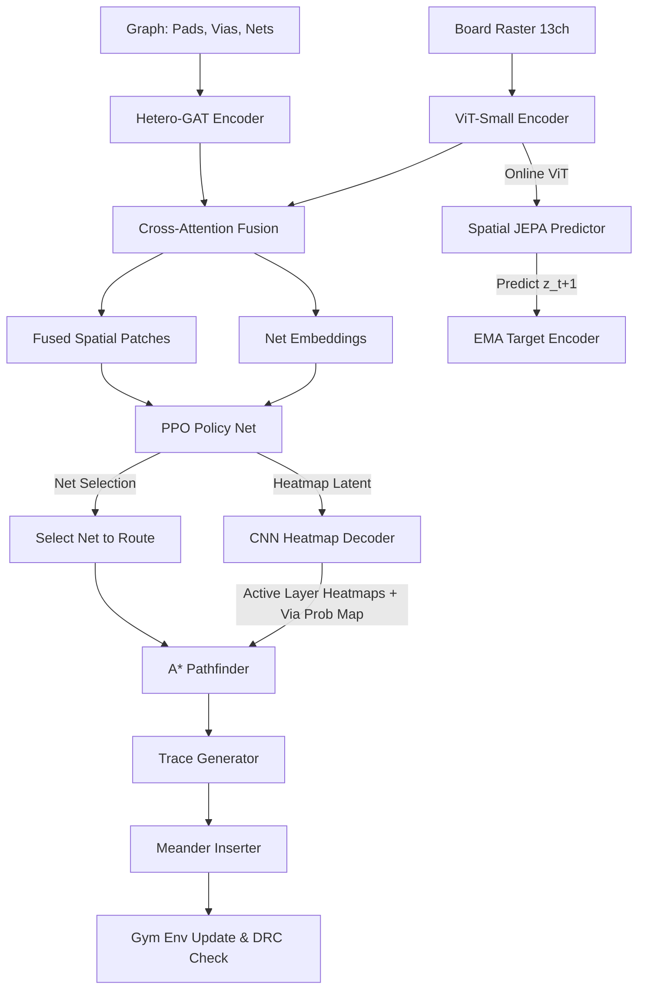

# PCB Router — AI-Powered PCB Routing

An AI agent that learns to route PCB traces using a hybrid **PPO reinforcement learning** policy guided by a **Spatial JEPA world model** for self-supervised representation learning. It integrates a 3D A* Pathfinder, a Meander length-matching module, and an interactive Streamlit visualization dashboard.

---

## 🚀 Key Highlights & Features

1. **Hybrid GNN + ViT Architecture**: Combines spatial 2D grid layouts of copper layers/obstacles (processed via Vision Transformer) with netlist/graph connectivity profiles (processed via Heterogeneous GAT) through Cross-Attention Fusion.
2. **Self-Supervised Representation (Spatial JEPA)**: Trains a ViT predictor to forecast spatial feature layouts using a predictor block and exponential moving average (EMA) target encoder to build a robust world model of the board state.
3. **Advanced Routing Modules**:
   - **A* Pathfinder (`pathfinder.py`)**: Performs multi-layer, 8-directional path planning using dynamic spatial cost heatmaps predicted by the neural policy.
   - **Meander Inserter (`meander.py`)**: Adjusts trace lengths via serpentine meandering to meet impedance and timing matching tolerances.
   - **Trace Generator (`trace_generator.py`)**: Constructs physical trace segment and pad geometries.
4. **Interactive Dashboard**: Streamlit interface (`dashboard/app.py`) for step-by-step routing inspection, checkpoint loading, curriculum exploration, and real-time design rule metrics.
5. **Curriculum-Based Stage Progression**: Implements 6 training stages, advancing from simple single-net routing to congested multi-net boards and real-world KiCad design imports.

---

## 🛠️ System Architecture



---

## 🛠️ Project Structure

```
├── dashboard/
│   └── app.py                  # Streamlit visual dashboard & interactive router
├── configs/
│   ├── training.yaml           # PPO hyperparams, JEPA loss coefficients, and checkpoints
│   ├── model.yaml              # ViT, GNN, JEPA, and decoder network dimension configs
│   └── curriculum.yaml         # Multi-stage routing curriculum & rewards
├── notebooks/
│   ├── 01_environment.py       # Gym env testing cell code
│   ├── 02_model_test.py        # Forward pass & network output verification cell code
│   ├── 03_training.py          # PPO + JEPA training invocation code
│   └── Train_PCB_Router.ipynb  # Comprehensive Colab training workflow
├── pcb_router/
│   ├── data/
│   │   ├── board_generator.py  # Procedural/Curriculum board generation
│   │   └── graph_builder.py    # Builds PyG HeteroData graphs for the board state
│   ├── env/
│   │   ├── board_state.py      # Grid-occupancy mapping & raster builders
│   │   ├── drc_checker.py      # Trace clearance & boundary design rule checker
│   │   └── pcb_env.py          # Custom Gymnasium environment setup
│   ├── models/
│   │   ├── vit_encoder.py      # ViT spatial representation encoder
│   │   ├── gnn_encoder.py      # Hetero GAT graph feature encoder
│   │   ├── fusion.py           # Cross-attention encoder merger
│   │   ├── jepa.py             # JEPA predictor & representation alignment
│   │   ├── policy.py           # PPO Actor-Critic policy (net & heatmap latents)
│   │   └── heatmap_decoder.py  # Transposed CNN outputting cost map & via placements
│   ├── routing/
│   │   ├── pathfinder.py       # Grid A* routing solver with direction change penalties
│   │   ├── meander.py          # Serpentine trace matching generator
│   │   └── trace_generator.py  # Trace segments & pin geometries exporter
│   ├── training/
│   │   ├── trainer.py          # PPO + JEPA Rollout & Update trainer module
│   │   ├── curriculum.py       # Stage metrics checker & progression logic
│   │   └── rewards.py          # Completion & DRC violation penalization logic
│   └── visualization/
│       ├── renderer.py         # Multi-layer board geometry visualizer
│       └── heatmap_viz.py      # Matplotlib colorized heatmap plotter
├── requirements.txt            # System dependencies list
└── setup.py                    # Local package installation setup
```

---

## 🏁 Quick Start

### 1. Installation

Set up a virtual environment and install dependencies:

```bash
git clone <your-repo-url>
cd Router

# Create and activate virtual environment
python -m venv venv
# On Windows:
# venv\Scripts\activate
# On macOS/Linux:
# source venv/bin/activate

# Install PyG (PyTorch Geometric) packages first
pip install torch-geometric
pip install torch-scatter torch-sparse -f https://data.pyg.org/whl/torch-$(python -c "import torch; print(torch.__version__.split('+')[0])")+cpu.html

# Install remaining dependencies and local package
pip install -r requirements.txt
pip install -e .
```

### 2. Training the Model

To launch the PPO + JEPA training loop locally using default configurations:

```bash
python notebooks/03_training.py --checkpoint-dir checkpoints
```

Alternatively, run training dynamically in Python:

```python
from pcb_router.training.trainer import PPOJEPATrainer

trainer = PPOJEPATrainer(
    config_path='configs/training.yaml',
    model_config_path='configs/model.yaml',
    curriculum_config_path='configs/curriculum.yaml'
)
trainer.train(total_timesteps=5_000_000)
```

### 3. Launching the Interactive Dashboard

Visualize model-driven routing decisions interactively:

```bash
streamlit run dashboard/app.py
```

Inside the dashboard, you can:
- Select curriculum stages (e.g., Single Net, Diff Pairs, Congested Multi-Net).
- Generate random board layouts dynamically.
- Load model checkpoints (or use untrained models) to test route predictions.
- Interactively select a netlist component and click **Route Selected Net** to see the cost heatmaps generated by the CNN decoder and how the A* pathfinder builds traces.

---

## 🎛️ Configuration

Key tuning parameters in `configs/`:

### `configs/training.yaml`
- `ppo.batch_size`: Batch size for gradient steps (default: `16` to prevent OOM).
- `ppo.num_rollout_steps`: Steps per environment before updating weights (default: `64`).
- `jepa_loss.prediction_weight`: Balance between JEPA self-supervised training and the RL objective.

### `configs/model.yaml`
- `vit.max_grid_size`: Maximum layout dimension size (default: `256`).
- `gnn.hidden_dim` & `gnn.out_dim`: Dimensions for GAT net-graph nodes.
- `heatmap_decoder.output_channels`: Total output channels (default: `9` for 8 copper layers + 1 via map).

### `configs/curriculum.yaml`
- `progression.completion_threshold`: Minimal completion rate to advance to next stage (default: `0.95`).
- `progression.drc_violation_threshold`: Maximum DRC violations percentage (default: `0.02`).

---

## 💻 Hardware Guidelines

| Hardware | Performance | Usage recommendation |
|----------|-------------|----------------------|
| **CPU Only** | ~10-30s per step | Best for debugging scripts and code logic |
| **GPU (8GB VRAM)** | ~0.5-2s per step | Recommended for standard local training |
| **GPU (16GB+ VRAM)** | <0.5s per step | Ideal; allows larger batch sizes and board dimensions |

---

## 📝 Checkpointing & Resuming

State checkpoints are saved under the directory specified in `configs/training.yaml` (default: `checkpoints/`). To resume from a checkpoint:

```python
trainer = PPOJEPATrainer(
    checkpoint_dir='checkpoints/',
    load_checkpoint_path='checkpoints/model_checkpoint_epoch_X.pt'
)
trainer.train(total_timesteps=1_000_000)
```
